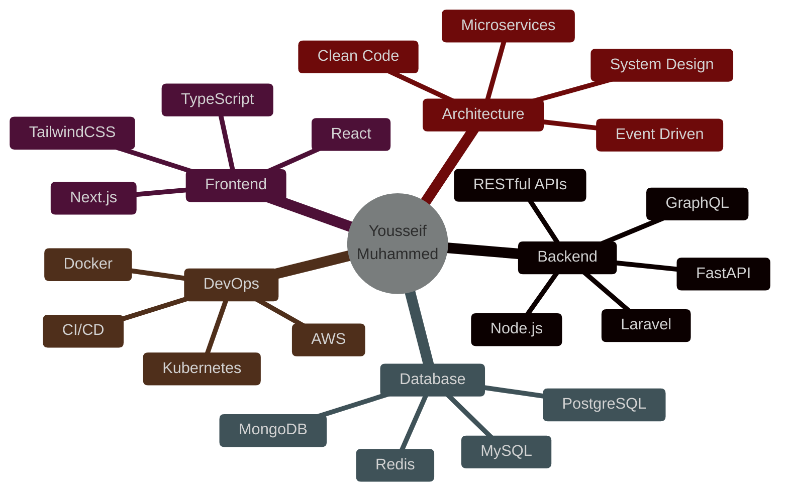

<!-- 🔥 Ultimate Professional GitHub Profile by Yousseif Muhammed -->

<div align="center">


</div>

<div align="center">

[](https://git.io/typing-svg)

</div>

<div align="center">

[](https://github.com/usif-x)
[](https://github.com/usif-x)
[](https://github.com/usif-x)

</div>

---


## 👨‍💻 About Me

```python
class BackendDeveloper:
    def __init__(self):
        self.name = "Yousseif Muhammed"
        self.role = "Backend Developer & API Architect"
        self.location = "Cairo, Egypt 🇪🇬"
        self.languages = ["Python", "PHP", "JavaScript", "TypeScript"]
        self.code = ["FastAPI", "Laravel", "Next.js", "React"]
        self.architecture = ["Microservices", "RESTful APIs", "Event-Driven"]
        self.currently_learning = [
            "AI/ML Integrations",
            "Cloud Native Development",
            "System Design Patterns",
            "GraphQL & tRPC"
        ]
        self.hobbies = ["Coding", "Problem Solving", "Tech Blogging"]
    
    def say_hi(self):
        print("Thanks for visiting! Let's build something amazing together 🚀")
    
    def get_daily_knowledge(self):
        return "Learning something new every day 📚"

me = BackendDeveloper()
me.say_hi()
```

<br clear="right"/>

- 🔭 Currently working on **FastAPI microservices** and **Next.js applications**
- 🌱 Deep diving into **AI integrations**, **cloud architectures**, and **system design**
- ⚡ Passionate about **API design**, **database optimization**, **security**, and **performance**
- 🧠 Building **secure**, **scalable**, and **maintainable** backend systems
- 💬 Ask me about **FastAPI, Laravel, React, Next.js, MongoDB, MySQL, Redis, Docker**
- 📚 Constantly learning and staying ahead of tech trends
- 🎯 2025 Goals: Contribute to open source, master cloud platforms, build production-grade AI apps
- ⚡ Fun fact: I debug with `console.log()` and I'm not ashamed! 😄

---

## 🛠️ Tech Stack & Tools

<details open>
<summary><b>🚀 Backend Technologies</b></summary>
<br>


</details>

<details open>
<summary><b>🌐 Frontend Technologies</b></summary>
<br>


</details>

<details open>
<summary><b>🗄️ Databases & Caching</b></summary>
<br>


</details>

<details open>
<summary><b>☁️ DevOps & Cloud</b></summary>
<br>


</details>

<details open>
<summary><b>⚙️ Development Tools</b></summary>
<br>


</details>

---

## 📊 GitHub Statistics

<div align="center">

### 🔥 Streak Stats
[](https://git.io/streak-stats)

</div>

<div align="center">
  
### 📈 GitHub Stats & Top Languages


</div>

<div align="center">

### 📊 Contribution Graph
[](https://github.com/ashutosh00710/github-readme-activity-graph)

</div>

<div align="center">

### 🏆 GitHub Trophies


</div>

<div align="center">

### 📊 Profile Summary Card


</div>

<div align="center">

### ⏰ Productive Time & Language Stats


</div>

---

## 🚀 Featured Projects

<div align="center">

<table>
<tr>
<td width="50%" valign="top">

### 🔐 FastAPI Auth System
[](https://github.com/usif-x/fastapi-auth)

**Enterprise-grade authentication system**
- 🔒 JWT & OAuth2 implementation
- 📧 Email verification & password reset
- 🛡️ Role-based access control (RBAC)
- 🗄️ MongoDB integration with Beanie ODM

**Tech:** FastAPI • MongoDB • JWT • Pydantic

</td>
<td width="50%" valign="top">

### 🌐 Laravel REST API
[](https://github.com/usif-x/laravel-api)

**Scalable RESTful API with Laravel**
- 🚀 High-performance API endpoints
- 👥 Advanced user management
- 🔑 Token-based authentication
- 📊 API rate limiting & caching

**Tech:** Laravel • MySQL • Redis • Sanctum

</td>
</tr>

<tr>
<td width="50%" valign="top">

### 📚 Next.js Learning Platform
[](https://github.com/usif-x/nextjs-learning-platform)

**Modern e-learning platform**
- 🎨 Beautiful, responsive UI/UX
- 📱 Mobile-first design approach
- ⚡ Server-side rendering (SSR)
- 🔍 SEO optimized

**Tech:** Next.js • React • TypeScript • TailwindCSS

</td>
<td width="50%" valign="top">

### 🤖 AI Chat Application
[](https://github.com/usif-x/ai-chat-app)

**Real-time AI-powered chat**
- 🤖 OpenAI GPT integration
- 💬 Real-time messaging with WebSockets
- 🎙️ Voice input support
- 💾 Conversation history

**Tech:** FastAPI • React • OpenAI • WebSockets

</td>
</tr>
</table>

</div>

---

## 🎯 Skills Matrix

<div align="center">



</div>

---

## 🎨 Coding Activity

<div align="center">

<!--START_SECTION:waka-->
<!--END_SECTION:waka-->

### 💻 Development Breakdown

```text
Backend      ████████████████████░░░░░   75%
Frontend     ████████████░░░░░░░░░░░░░   45%
DevOps       ████████░░░░░░░░░░░░░░░░░   30%
Database     ███████████████░░░░░░░░░░   60%
Learning     ████████████████████░░░░░   80%
```

</div>

---

## 🏅 Achievements & Certifications

<div align="center">

| Achievement | Description | Date |
|-------------|-------------|------|
| 🎓 **Backend Master** | Completed 100+ backend projects | 2024 |
| 🚀 **API Architect** | Built 50+ production APIs | 2024 |
| 🌟 **Open Source** | 10+ contributions to OS projects | 2025 |
| 📚 **Tech Blogger** | Published 25+ technical articles | 2024-2025 |
| ⚡ **Performance Pro** | Optimized apps by 300% | 2024 |

</div>

---

## 📝 Latest Blog Posts

<!-- BLOG-POST-LIST:START -->
- 🚀 Building Scalable APIs with FastAPI and MongoDB
- 🔐 Implementing JWT Authentication in Laravel
- ⚡ Next.js 14: Server Components Deep Dive
- 🐳 Docker Best Practices for Python Applications
- 📊 Database Optimization Techniques
<!-- BLOG-POST-LIST:END -->

---

## 💡 Random Dev Quote

<div align="center">


</div>

---

## 🌟 Support My Work

<div align="center">

If you like my work, consider giving a ⭐ to my repositories!

[](https://buymeacoffee.com/yousseif)
[](https://paypal.me/yousseifmuhammed)

</div>

---

## 📫 Let's Connect & Collaborate

<div align="center">

[](mailto:yousseifmuhammed@gmail.com)
[](https://yousseif.xyz)
[](https://linkedin.com/in/yousseifmuhammed)
[](https://github.com/usif-x)
[](https://twitter.com/yousseifmuhammed)
[](https://dev.to/yousseifmuhammed)

</div>

---

<div align="center">

### 🎯 Current Focus

**Building production-ready microservices • Mastering system design • Contributing to open source • Learning AI/ML**

### 💭 Philosophy

> *"First, solve the problem. Then, write the code."* – John Johnson

> *"Any fool can write code that a computer can understand. Good programmers write code that humans can understand."* – Martin Fowler

### ⚡ Quick Facts

🔹 Available for freelance projects & collaborations  
🔹 Open to remote opportunities  
🔹 Passionate about mentoring junior developers  
🔹 Love working on challenging problems  

---


**Thanks for visiting! Let's build something amazing together** ✨


</div>
